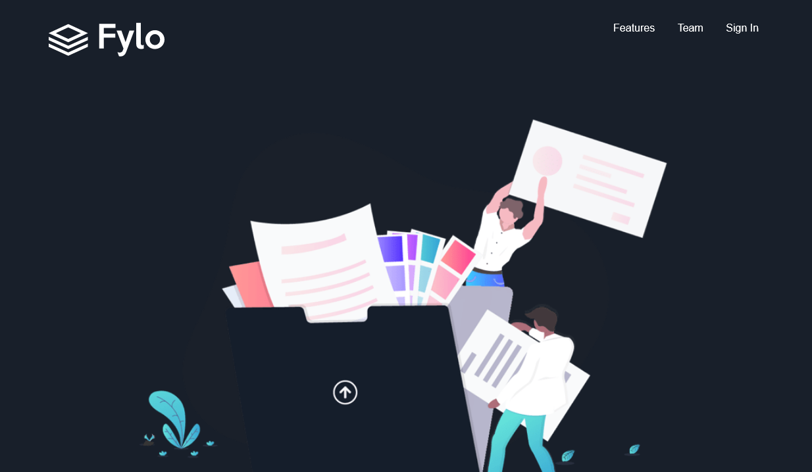

# Frontend Mentor - Fylo dark theme landing page solution

This is a solution to the [Fylo dark theme landing page challenge on Frontend Mentor](https://www.frontendmentor.io/challenges/fylo-dark-theme-landing-page-5ca5f2d21e82137ec91a50fd). Frontend Mentor challenges help you improve your coding skills by building realistic projects. 

## Table of contents

- [Overview](#overview)
  - [The challenge](#the-challenge)
  - [Screenshot](#screenshot)
  - [Links](#links)
- [My process](#my-process)
  - [Built with](#built-with)
  - [What I learned](#what-i-learned)
  - [Author](#author)
  - [Acknowledgments](#acknowledgments)


## Overview

### The challenge

Users should be able to:

- View the optimal layout for the site depending on their device's screen size
- See hover states for all interactive elements on the page

### Screenshot




### Links

- Solution URL: (https://github.com/MaureenMOguche/Fylo)
- Live Site URL: (https://maureenmoguche.github.io/Fylo)

## My process

### Built with

- Semantic HTML5 markup
- CSS custom properties
- Flexbox
- CSS Grid
- Media Queries


### What I learned

I learnt how to use CSS custom properties, how to declare them and use them throughout the workflow.

I also learnt about the Z-index and how it affects elements on the page.

Examples of what I learnt:

```html
<div class="float"><h1> Get early access</h1></div>


```
```css
.float {
  position: absolute;
  top:450%;
}

.quote {
    position:absolute;
    z-index: -1;
    left: 6%;
    top:382%;
}
```

## Author

- Frontend Mentor - (https://www.frontendmentor.io/profile/MaureenO)
- Twitter - (https://www.twitter.com/MaureenOguche)


## Acknowledgments

Side Hustle Frontend (html/css/js) Capstone Project Team 272: @Olawale00
